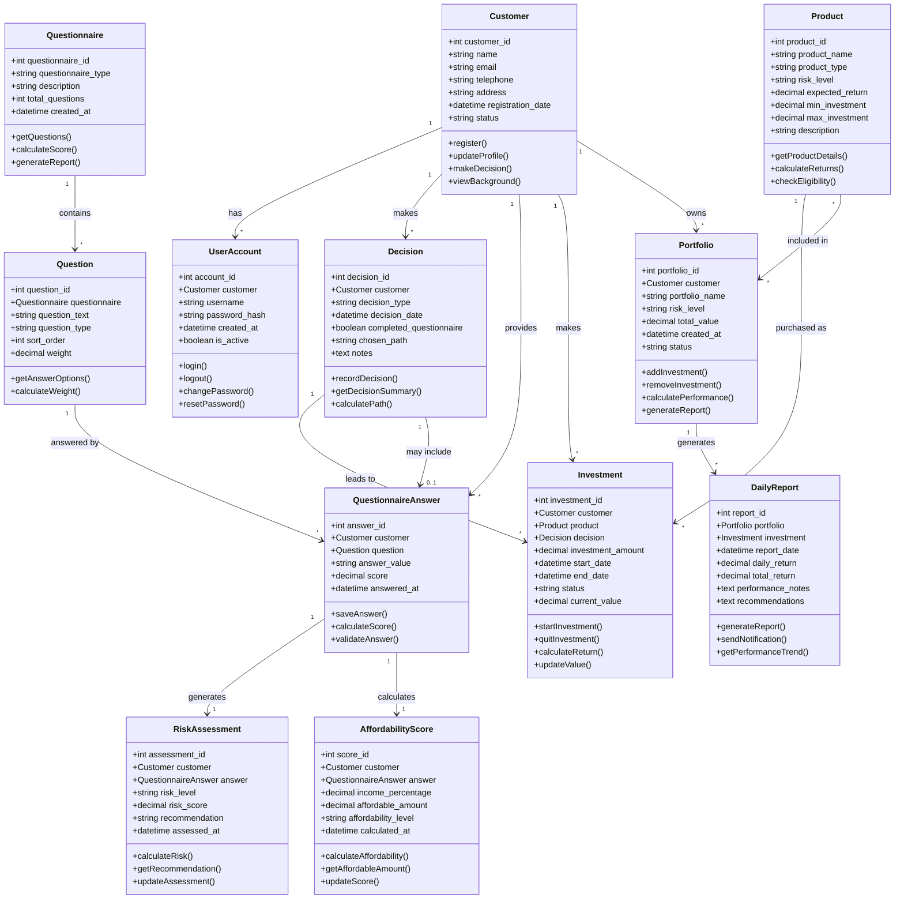

# Financial Investment System UML Diagram (Formatted)

## Class Diagram

## Simplified Relationship Summary

| Relationship | Cardinality | Description |
|--------------|-------------|-------------|
| Customer → UserAccount | 1:N | Customer can have multiple accounts |
| Customer → Decision | 1:N | Customer makes multiple decisions |
| Customer → QuestionnaireAnswer | 1:N | Customer provides multiple answers |
| Customer → Investment | 1:N | Customer makes multiple investments |
| Customer → Portfolio | 1:N | Customer owns multiple portfolios |
| Questionnaire → Question | 1:N | Questionnaire contains multiple questions |
| Question → QuestionnaireAnswer | 1:N | Question can have multiple answers |
| QuestionnaireAnswer → RiskAssessment | 1:1 | Each answer generates one risk assessment |
| QuestionnaireAnswer → AffordabilityScore | 1:1 | Each answer calculates one affordability score |
| Product → Investment | 1:N | Product can be purchased as multiple investments |
| Product → Portfolio | M:N | Products can be included in multiple portfolios |
| Portfolio → DailyReport | 1:N | Portfolio generates multiple daily reports |
| Decision → Investment | 1:N | Decision leads to multiple investments |
| Decision → QuestionnaireAnswer | 0..1:1 | Decision may include questionnaire answers |

*Note: This formatted version focuses on the class diagram with directional relationships for clarity.*