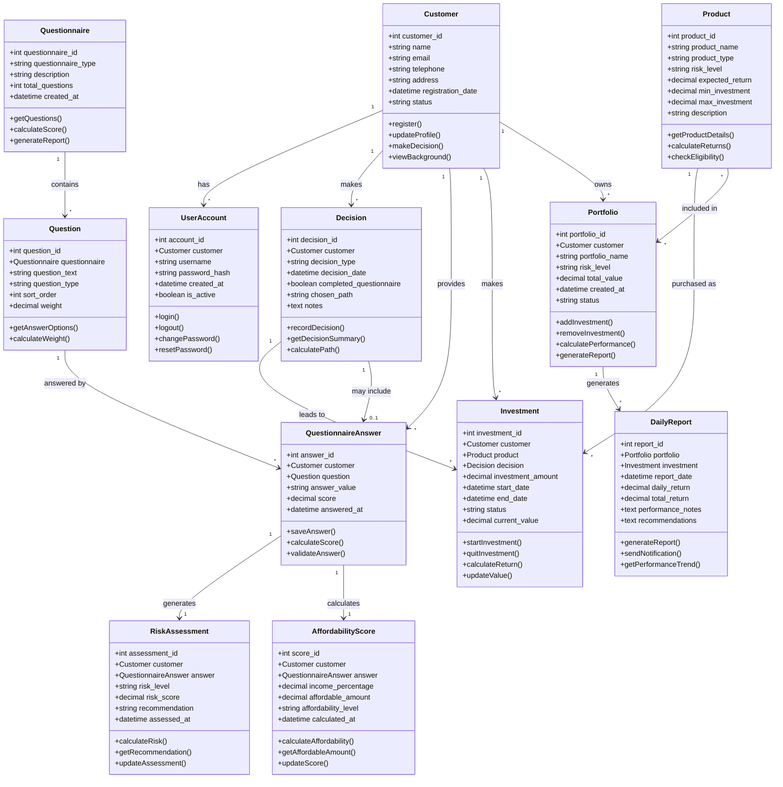
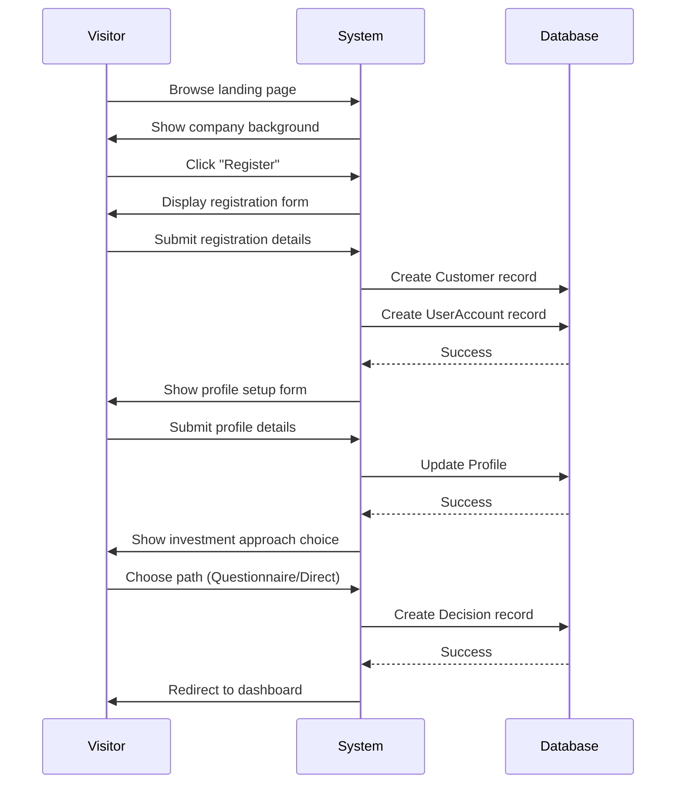
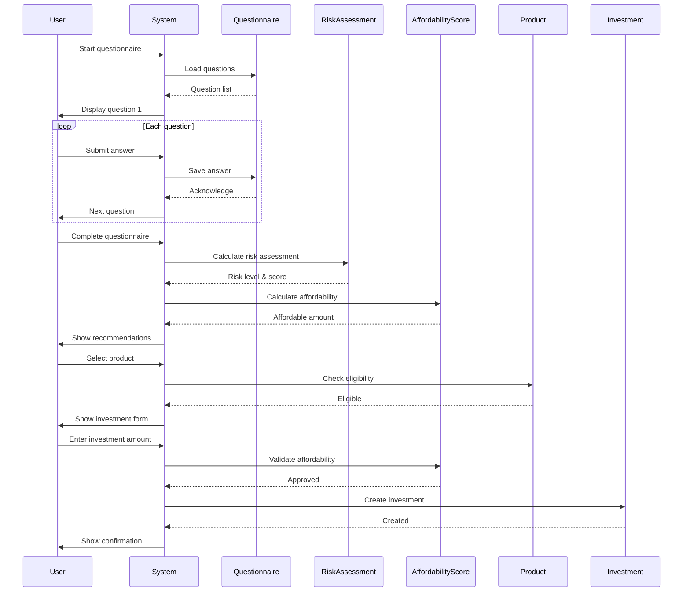
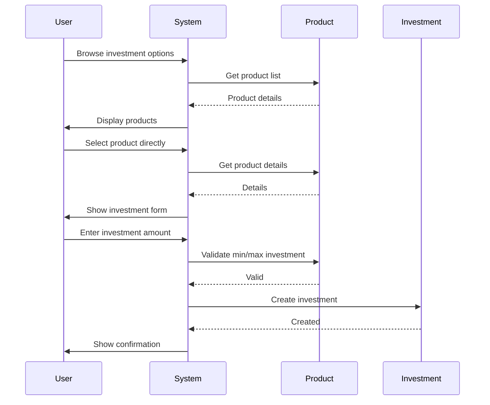
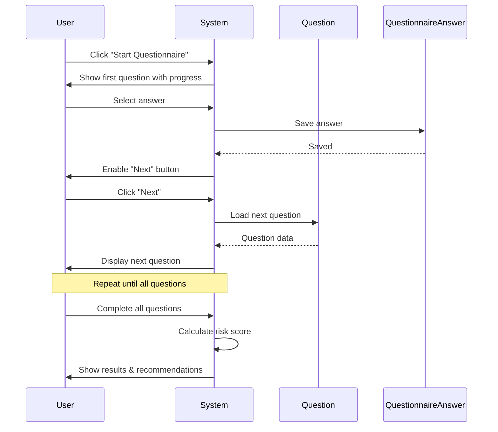
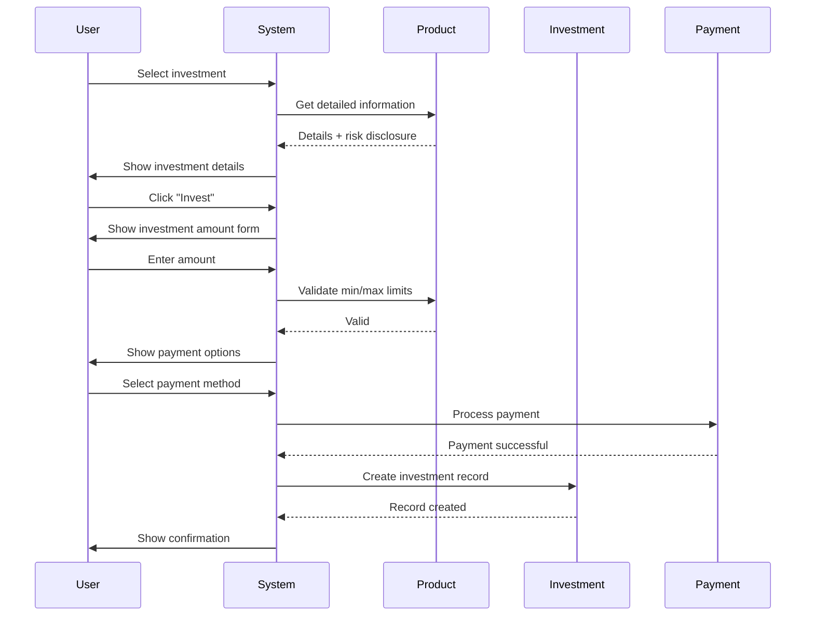
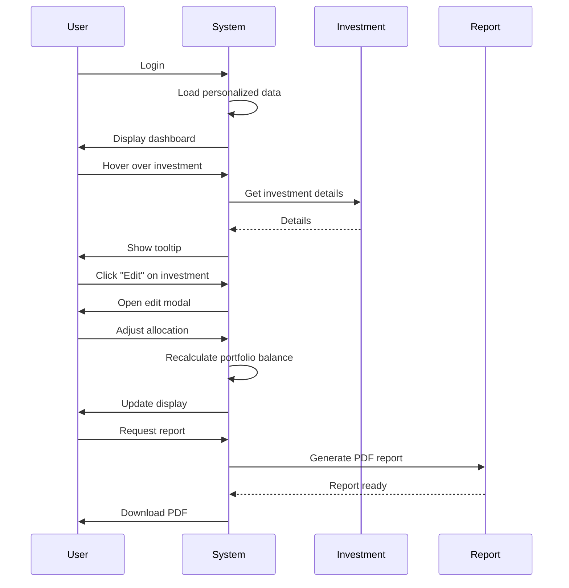

# Financial Investment System UML Diagram with Workflow

## Overview
This document combines the static UML class diagram with dynamic workflow diagrams based on the UI/UX workflow description. It provides a comprehensive view of both structure and behavior.

## Static Structure: Class Diagram

## Dynamic Behavior: Workflow Diagrams

### 1. Visitor Registration Journey
*Based on UI/UX workflow: Visitor → Registered User Journey*

### 2. Investment Decision Journey - Questionnaire Path
*Based on UI/UX workflow: Questionnaire Path*

### 3. Investment Decision Journey - Direct Purchase Path
*Based on UI/UX workflow: Direct Purchase Path*

### 4. Questionnaire Flow (Detailed Interaction)
*Based on UI/UX workflow: Questionnaire Flow*

### 5. Investment Process Flow
*Based on UI/UX workflow: Investment Process*

### 6. Dashboard Interaction Flow
*Based on UI/UX workflow: Dashboard Interactions*

## Integrated View: Connecting Structure with Flow

### How Classes Participate in Workflows

| Workflow | Key Participating Classes | Interactions |
|----------|---------------------------|--------------|
| Visitor Registration | Customer, UserAccount, Decision | Customer registers → UserAccount created → Decision recorded |
| Questionnaire Path | Customer, Questionnaire, Question, QuestionnaireAnswer, RiskAssessment, AffordabilityScore | Customer answers questions → Answers stored → Risk & Affordability calculated |
| Direct Purchase Path | Customer, Product, Investment, Decision | Customer selects product → Investment created → Decision recorded |
| Investment Process | Customer, Product, Investment, Portfolio | Customer invests → Investment linked to Product → Added to Portfolio |
| Dashboard | Customer, Investment, Portfolio, DailyReport | Customer views dashboard → Investments displayed → Reports generated |

### Business Rules Implementation

1. **Path Decision**: 
   - `Decision.chosen_path` determines whether user took questionnaire or direct purchase
   - `Decision.completed_questionnaire` boolean flag

2. **Risk Matching**:
   - `Product.risk_level` must match `RiskAssessment.risk_level` for recommendations
   - `Investment.investment_amount` must be within `Product.min_investment` and `Product.max_investment`

3. **Affordability Validation**:
   - `Investment.investment_amount` ≤ `AffordabilityScore.affordable_amount`
   - Calculated as `Profile.monthly_income` × `AffordabilityScore.income_percentage`

4. **Portfolio Management**:
   - `Portfolio.total_value` = sum of `Investment.current_value` for all investments in portfolio
   - `DailyReport` generated daily for each active portfolio

## Relationship Summary

| Relationship | Cardinality | Description | Flow Involvement |
|--------------|-------------|-------------|------------------|
| Customer → UserAccount | 1:N | Customer can have multiple accounts | Registration flow |
| Customer → Decision | 1:N | Customer makes multiple decisions | Decision point flow |
| Customer → QuestionnaireAnswer | 1:N | Customer provides multiple answers | Questionnaire flow |
| Customer → Investment | 1:N | Customer makes multiple investments | Investment flow |
| Customer → Portfolio | 1:N | Customer owns multiple portfolios | Portfolio management flow |
| Questionnaire → Question | 1:N | Questionnaire contains multiple questions | Questionnaire flow |
| Question → QuestionnaireAnswer | 1:N | Question can have multiple answers | Questionnaire flow |
| QuestionnaireAnswer → RiskAssessment | 1:1 | Each answer generates one risk assessment | Risk assessment flow |
| QuestionnaireAnswer → AffordabilityScore | 1:1 | Each answer calculates one affordability score | Affordability flow |
| Product → Investment | 1:N | Product can be purchased as multiple investments | Investment flow |
| Product → Portfolio | M:N | Products can be included in multiple portfolios | Portfolio composition |
| Portfolio → DailyReport | 1:N | Portfolio generates multiple daily reports | Reporting flow |
| Decision → Investment | 1:N | Decision leads to multiple investments | Decision tracking |

## Conclusion

This integrated UML diagram with workflow provides a complete picture of the financial investment system:
- **Static structure** shows the entities and their relationships
- **Dynamic behavior** shows how users interact with the system through key workflows
- **Connection points** illustrate how classes participate in each workflow

The diagrams use the terminology and flow descriptions from the UI/UX workflow document, ensuring consistency between design and implementation.