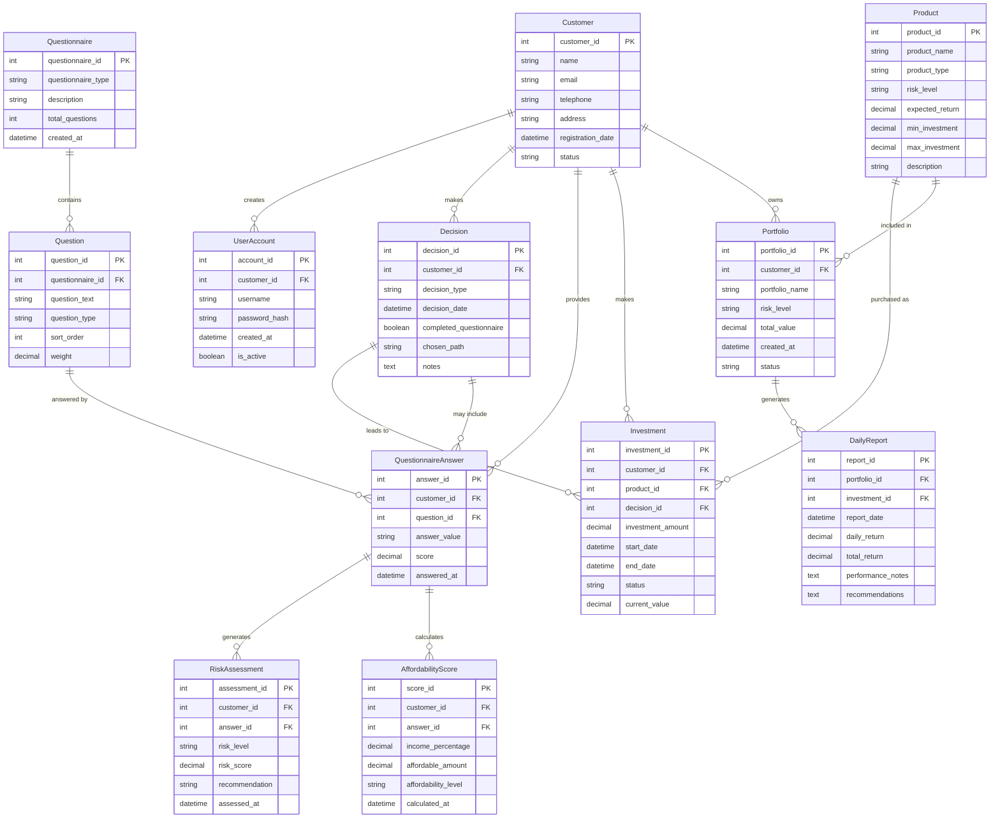
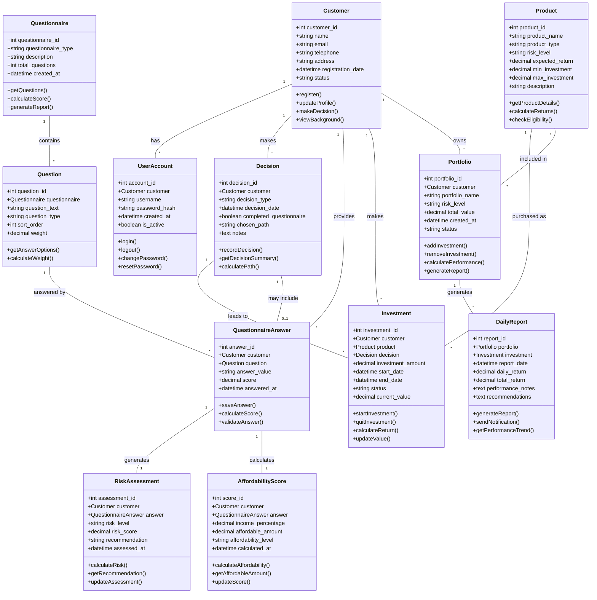

# Financial Investment System UML Diagram

## Entity Relationship Diagram

## Class Diagram with Relationships

## Relationship Summary Table

| Relationship | Type | Description | Cardinality |
|--------------|------|-------------|-------------|
| Customer → UserAccount | One-to-Many | Customer can have multiple accounts | 1:N |
| Customer → Decision | One-to-Many | Customer makes multiple decisions | 1:N |
| Customer → QuestionnaireAnswer | One-to-Many | Customer provides multiple answers | 1:N |
| Customer → Investment | One-to-Many | Customer makes multiple investments | 1:N |
| Customer → Portfolio | One-to-Many | Customer owns multiple portfolios | 1:N |
| Questionnaire → Question | One-to-Many | Questionnaire contains multiple questions | 1:N |
| Question → QuestionnaireAnswer | One-to-Many | Question can have multiple answers from different customers | 1:N |
| QuestionnaireAnswer → RiskAssessment | One-to-One | Each answer generates one risk assessment | 1:1 |
| QuestionnaireAnswer → AffordabilityScore | One-to-One | Each answer calculates one affordability score | 1:1 |
| Product → Investment | One-to-Many | Product can be purchased as multiple investments | 1:N |
| Product → Portfolio | Many-to-Many | Products can be included in multiple portfolios | M:N |
| Portfolio → DailyReport | One-to-Many | Portfolio generates multiple daily reports | 1:N |
| Decision → Investment | One-to-Many | Decision leads to multiple investments | 1:N |
| Decision → QuestionnaireAnswer | Zero-or-One-to-One | Decision may include questionnaire answers | 0..1:1 |

## Business Logic Implementation

### Customer Journey Flow
1. **Visitor Phase**: View company background → Register account → Fill basic information
2. **Decision Point**: Choose between:
   - Path A: Direct purchase without questionnaire
   - Path B: Complete questionnaire for assessment
3. **Assessment Phase** (Path B only):
   - Risk level assessment
   - Affordability calculation
   - Income percentage analysis
4. **Product Selection**:
   - High/Medium/Low return options
   - Based on preference or system recommendation
5. **Investment Management**:
   - Portfolio creation
   - Daily performance reporting
   - Option to change/quit investments

### Key Business Rules
1. **Questionnaire Scoring**:
   - Psychological questions determine risk tolerance
   - Demographic questions determine affordability
   - Weighted ratio calculation for investment capacity
   
2. **Product Eligibility**:
   - Risk level must match customer's risk assessment
   - Investment amount must be within affordable range
   - Minimum investment requirements per product
   
3. **Portfolio Management**:
   - Customers can have multiple portfolios
   - Portfolios can contain multiple products
   - Daily performance tracking and reporting
   
4. **Decision Tracking**:
   - Record all customer decisions
   - Track questionnaire completion status
   - Monitor investment paths chosen

### System Features
1. **Background Information**: Company history, credentials, philosophy
2. **Questionnaire System**: Risk assessment + affordability calculation
3. **Decision Support**: Recommendations based on questionnaire results
4. **Product Catalog**: High/Medium/Low return investment options
5. **Portfolio Management**: Investment tracking and reporting
6. **Customer Management**: Account management and profile updates

This UML diagram captures the complete system architecture based on your detailed requirements, including all entities, relationships, and business logic for the financial investment platform.
