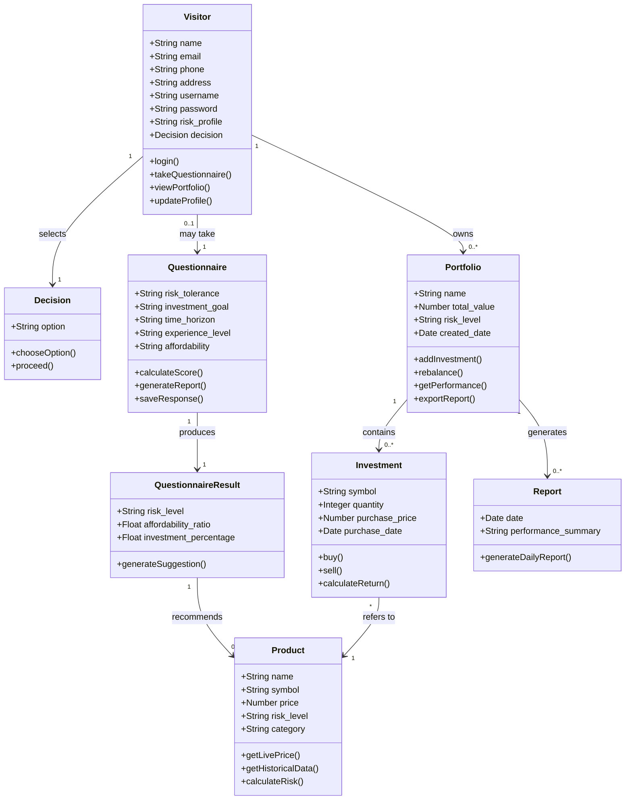

classDiagram
    class Visitor {
        +String name
        +String email
        +String phone
        +String address
        +String username
        +String password
        +String risk_profile
        +Decision decision
        +login()
        +takeQuestionnaire()
        +viewPortfolio()
        +updateProfile()
    }

    class Decision {
        +String option
        +chooseOption()
        +proceed()
    }

    class Questionnaire {
        +String risk_tolerance
        +String investment_goal
        +String time_horizon
        +String experience_level
        +String affordability
        +calculateScore()
        +generateReport()
        +saveResponse()
    }

    class QuestionnaireResult {
        +String risk_level
        +Float affordability_ratio
        +Float investment_percentage
        +generateSuggestion()
    }

    class Product {
        +String name
        +String symbol
        +Decimal price
        +String risk_level
        +String category
        +getLivePrice()
        +getHistoricalData()
        +calculateRisk()
    }

    class Investment {
        +String symbol
        +Integer quantity
        +Decimal purchase_price
        +Date purchase_date
        +buy()
        +sell()
        +calculateReturn()
    }

    class Portfolio {
        +String name
        +Decimal total_value
        +String risk_level
        +Date created_date
        +addInvestment()
        +rebalance()
        +getPerformance()
        +exportReport()
    }

    class Report {
        +Date date
        +String performance_summary
        +generateDailyReport()
    }

    %% Relationships
    Visitor "1" --> "1" Decision : selects
    Visitor "0..1" --> "1" Questionnaire : may take
    Questionnaire "1" --> "1" QuestionnaireResult : produces
    Visitor "1" --> "0..*" Portfolio : owns
    Portfolio "1" --> "0..*" Investment : contains
    Investment "*" --> "1" Product : refers to
    Portfolio "1" --> "0..*" Report : generates
    QuestionnaireResult "1" --> "0..*" Product : recommends
