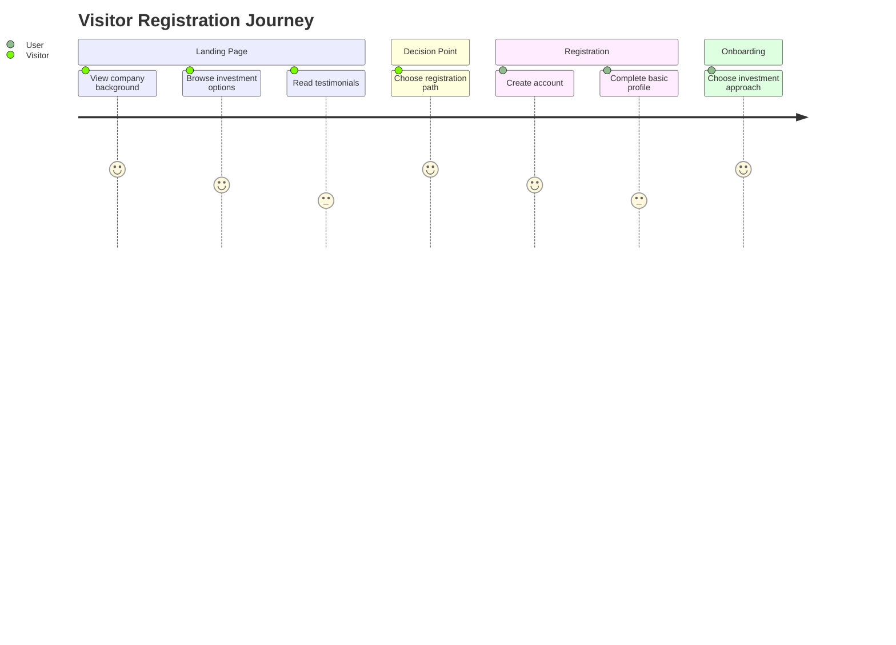
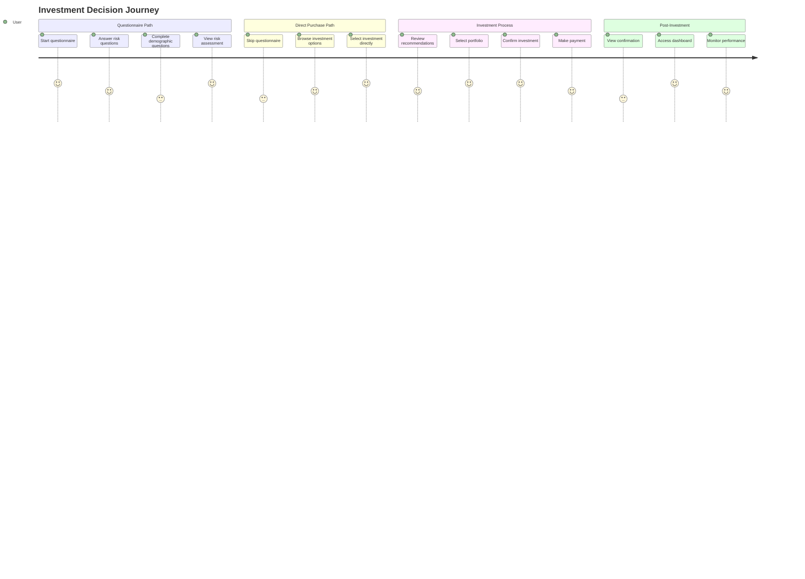

# Financial Investment System - UI/UX Workflow

## Overview
This document converts the UML diagram into user-centered workflows, wireframes, and interaction patterns for the financial investment system.

## User Personas

### 1. Visitor (Unauthenticated User)
- **Goals**: Learn about company, understand investment options, decide to register
- **Pain Points**: Uncertainty about trustworthiness, unclear investment process
- **Key Tasks**: Browse site, view company background, start registration

### 2. Registered User
- **Goals**: Complete questionnaire, get investment recommendations, make investments
- **Pain Points**: Complex forms, unclear risk assessment, investment uncertainty
- **Key Tasks**: Complete profile, answer questionnaire, view recommendations, invest

### 3. Administrator
- **Goals**: Manage users, upload investment data, generate reports, configure system
- **Pain Points**: Data management complexity, reporting accuracy, user support
- **Key Tasks**: User management, content management, report generation, system configuration

## User Journey Maps

### Visitor → Registered User Journey


### Investment Decision Journey


## Screen Flow Diagrams

### Main Application Flow
```
┌─────────────────┐     ┌─────────────────┐     ┌─────────────────┐
│   Landing Page  │────▶│   Registration  │────▶│   Dashboard     │
└─────────────────┘     └─────────────────┘     └─────────────────┘
         │                       │                       │
         ▼                       ▼                       ▼
┌─────────────────┐     ┌─────────────────┐     ┌─────────────────┐
│ Company Background│    │   Profile Setup │    │Investment Decision│
└─────────────────┘     └─────────────────┘     └─────────────────┘
                                                           │
                    ┌──────────────────────────────────────┘
                    ▼
         ┌─────────────────────┐
         │   Questionnaire?    │
         └─────────────────────┘
                    │
        ┌───────────┴───────────┐
        ▼                       ▼
┌───────────────┐       ┌───────────────┐
│ Questionnaire │       │ Direct Browse │
│   Path        │       │   Path        │
└───────────────┘       └───────────────┘
        │                       │
        ▼                       ▼
┌───────────────┐       ┌───────────────┐
│ Risk Assessment│      │ Investment     │
│ & Recommendations│    │ Selection      │
└───────────────┘       └───────────────┘
        │                       │
        └───────────┬───────────┘
                    ▼
         ┌─────────────────────┐
         │ Portfolio Selection │
         └─────────────────────┘
                    │
                    ▼
         ┌─────────────────────┐
         │ Investment Confirmation│
         └─────────────────────┘
                    │
                    ▼
         ┌─────────────────────┐
         │   Payment &         │
         │   Completion        │
         └─────────────────────┘
```

## Wireframe Sketches

### Landing Page (Visitor)
```
┌─────────────────────────────────────────────────────────┐
│                     Company Logo                         │
├─────────────────────────────────────────────────────────┤
│ [Home] [About] [Investments] [Contact] [Login] [Register]│
├─────────────────────────────────────────────────────────┤
│                                                         │
│  HERO SECTION                                           │
│  ┌─────────────────────────────────────────────────┐   │
│  │  Smart Investments for Your Future              │   │
│  │  Get personalized recommendations based on      │   │
│  │  your risk tolerance and financial goals        │   │
│  │                                                 │   │
│  │  [Get Started] [Learn More]                     │   │
│  └─────────────────────────────────────────────────┘   │
│                                                         │
│  COMPANY BACKGROUND                                     │
│  ┌─────────────────────────────────────────────────┐   │
│  │  Trusted Since 2010 | Licensed & Regulated      │   │
│  │  View our credentials and company history       │   │
│  │  [View Background]                               │   │
│  └─────────────────────────────────────────────────┘   │
│                                                         │
│  INVESTMENT OPTIONS                                     │
│  ┌─────┐  ┌─────┐  ┌─────┐                             │
│  │High │  │Med  │  │Low  │                             │
│  │Risk │  │Risk │  │Risk │                             │
│  │     │  │     │  │     │                             │
│  └─────┘  └─────┘  └─────┘                             │
│                                                         │
└─────────────────────────────────────────────────────────┘
```

### Registration & Profile Setup
```
┌─────────────────────────────────────────────────────────┐
│                     Create Account                       │
├─────────────────────────────────────────────────────────┤
│ Step 1 of 3: Basic Information                          │
├─────────────────────────────────────────────────────────┤
│                                                         │
│  ┌─────────────────────────────────────────────────┐   │
│  │  Username: [_______________]                    │   │
│  │  Email:    [_______________]                    │   │
│  │  Password: [_______________]                    │   │
│  │  Confirm:  [_______________]                    │   │
│  └─────────────────────────────────────────────────┘   │
│                                                         │
│  Step 2 of 3: Profile Details                          │
│  ┌─────────────────────────────────────────────────┐   │
│  │  Age:          [___]                            │   │
│  │  Gender:       [○ Male ○ Female ○ Other]        │   │
│  │  Occupation:   [_______________]                │   │
│  │  Monthly Income: [_______________]              │   │
│  │  Investment % of income: [___%]                 │   │
│  └─────────────────────────────────────────────────┘   │
│                                                         │
│  Step 3 of 3: Investment Approach                      │
│  ┌─────────────────────────────────────────────────┐   │
│  │  How would you like to proceed?                 │   │
│  │                                                 │   │
│  │  ○ Take questionnaire for personalized rec      │   │
│  │    (Recommended for first-time investors)       │   │
│  │                                                 │   │
│  │  ○ Browse investments directly                  │   │
│  │    (For experienced investors)                  │   │
│  │                                                 │   │
│  │  [Complete Registration]                        │   │
│  └─────────────────────────────────────────────────┘   │
│                                                         │
└─────────────────────────────────────────────────────────┘
```

### Questionnaire Interface
```
┌─────────────────────────────────────────────────────────┐
│               Risk Assessment Questionnaire              │
├─────────────────────────────────────────────────────────┤
│ Question 5 of 10                                        │
│ Progress: ██████████░░░░░░░░ 50%                       │
├─────────────────────────────────────────────────────────┤
│                                                         │
│  "In uncertain times, I usually expect the best."      │
│                                                         │
│  How much do you agree with this statement?            │
│                                                         │
│  ┌─────────────────────────────────────────────────┐   │
│  │  ○ Strongly Disagree (0)                        │   │
│  │  ○ Disagree (1)                                 │   │
│  │  ○ Neutral (2)                                  │   │
│  │  ○ Agree (3)                                    │   │
│  │  ○ Strongly Agree (4)                           │   │
│  └─────────────────────────────────────────────────┘   │
│                                                         │
│  [Previous]                   [Next]                    │
│                                                         │
│  Need help? [View explanation]                         │
│                                                         │
└─────────────────────────────────────────────────────────┘
```

### Investment Dashboard
```
┌─────────────────────────────────────────────────────────┐
│                   Investment Dashboard                   │
├─────────────────────────────────────────────────────────┤
│ Welcome, John!                      [View Profile]      │
├─────────────────────────────────────────────────────────┤
│                                                         │
│  PORTFOLIO OVERVIEW                                    │
│  ┌─────────────────────────────────────────────────┐   │
│  │  Total Investment: $25,000                      │   │
│  │  Current Value:   $26,450 (+5.8%)               │   │
│  │  Today's Change:  +$120 (+0.46%)                │   │
│  │                                                 │   │
│  │  Risk Level: Medium                             │   │
│  │  Recommended: Based on your questionnaire       │   │
│  └─────────────────────────────────────────────────┘   │
│                                                         │
│  YOUR INVESTMENTS                                      │
│  ┌─────┬──────────────┬─────────┬─────────┬──────┐    │
│  │ #   │ Name         │ Amount  │ Return  │ Action│   │
│  ├─────┼──────────────┼─────────┼─────────┼──────┤    │
│  │ 1   │ Tech Growth  │ $10,000 │ +12.3%  │ [Edit]│   │
│  │ 2   │ Balanced     │ $8,000  │ +4.2%   │ [Edit]│   │
│  │ 3   │ Green Energy │ $7,000  │ +8.7%   │ [Edit]│   │
│  └─────┴──────────────┴─────────┴─────────┴──────┘    │
│                                                         │
│  RECOMMENDATIONS                                       │
│  ┌─────────────────────────────────────────────────┐   │
│  │  Based on your risk profile, consider:          │   │
│  │  • Sustainable Energy Fund (+2% allocation)     │   │
│  │  • International Bonds (-5% risk)               │   │
│  │                                                 │   │
│  │  [Adjust Portfolio] [View Details]              │   │
│  └─────────────────────────────────────────────────┘   │
│                                                         │
│  QUICK ACTIONS                                         │
│  ┌─────┐  ┌─────┐  ┌─────┐  ┌─────┐                   │
│  │Add  │  │With-│  │Re-  │  │Daily│                   │
│  │Funds│  │draw │  │balance│ │Report│                  │
│  └─────┘  └─────┘  └─────┘  └─────┘                   │
│                                                         │
└─────────────────────────────────────────────────────────┘
```

### Administrator Dashboard
```
┌─────────────────────────────────────────────────────────┐
│                 Administrator Dashboard                  │
├─────────────────────────────────────────────────────────┤
│ System Overview                         [Admin Settings]│
├─────────────────────────────────────────────────────────┤
│                                                         │
│  SYSTEM METRICS                                        │
│  ┌─────┬─────┬─────┬─────┐                             │
│  │Users│Active│Today's│Total │                         │
│  │ 1.2K│ 856  │ 42   │Invest│                         │
│  │     │      │      │$2.4M │                         │
│  └─────┴─────┴─────┴─────┘                             │
│                                                         │
│  USER MANAGEMENT                                       │
│  ┌─────────────────────────────────────────────────┐   │
│  │  Search: [_________________] [Search]           │   │
│  │                                                 │   │
│  │  ┌─────┬──────────────┬─────────┬──────┐       │   │
│  │  │ ID  │ Username     │ Status  │ Action│      │   │
│  │  ├─────┼──────────────┼─────────┼──────┤       │   │
│  │  │ 101 │ john_doe     │ Active  │ [Edit]│      │   │
│  │  │ 102 │ jane_smith   │ Inactive│ [Edit]│      │   │
│  │  │ ... │ ...          │ ...     │ ...   │      │   │
│  │  └─────┴──────────────┴─────────┴──────┘       │   │
│  │                                                 │   │
│  │  [Add User] [Export CSV] [Bulk Actions]         │   │
│  └─────────────────────────────────────────────────┘   │
│                                                         │
│  INVESTMENT DATA MANAGEMENT                            │
│  ┌─────────────────────────────────────────────────┐   │
│  │  Upload Historical Data                         │   │
│  │  ┌─────────────────────────────────────────┐   │   │
│  │  │ Drag & drop CSV file or [Browse]        │   │   │
│  │  └─────────────────────────────────────────┘   │   │
│  │                                                 │   │
│  │  Recent Uploads:                                │   │
│  │  • fund_prices_2025.csv (Yesterday)            │   │
│  │  • portfolio_data.csv (2 days ago)             │   │
│  │                                                 │   │
│  │  [Manage Data] [Generate Reports]              │   │
│  └─────────────────────────────────────────────────┘   │
│                                                         │
│  REPORT GENERATION                                     │
│  ┌─────────────────────────────────────────────────┐   │
│  │  Generate Reports:                              │   │
│  │  ○ Daily Performance                            │   │
│  │  ○ User Activity                                │   │
│  │  ○ Risk Assessment Summary                      │   │
│  │  ○ Investment Trends                            │   │
│  │                                                 │   │
│  │  Date Range: [01/01/2026] to [01/23/2026]       │   │
│  │                                                 │   │
│  │  [Generate PDF] [Export Excel] [Email Reports]  │   │
│  └─────────────────────────────────────────────────┘   │
│                                                         │
└─────────────────────────────────────────────────────────┘
```

## Interaction Patterns

### 1. Questionnaire Flow
```
User Action → System Response
1. User clicks "Start Questionnaire" → System shows first question with progress indicator
2. User selects answer → System validates and enables "Next" button
3. User clicks "Next" → System saves answer, loads next question
4. User completes all questions → System calculates risk score, shows results
5. User views recommendations → System displays personalized investment options
```

### 2. Investment Process
```
User Action → System Response
1. User selects investment → System shows detailed information and risk disclosure
2. User clicks "Invest" → System shows investment amount form
3. User enters amount → System validates against min/max limits
4. User confirms → System shows payment options
5. User completes payment → System creates investment record, shows confirmation
```

### 3. Dashboard Interactions
```
User Action → System Response
1. User logs in → System loads personalized dashboard with latest data
2. User hovers over investment → System shows tooltip with details
3. User clicks "Edit" on investment → System opens edit modal
4. User adjusts allocation → System recalculates portfolio balance
5. User requests report → System generates and downloads PDF
```

## Component Library

### Form Components
- **Text Input**: Standard, with validation states (error, success, warning)
- **Radio Groups**: For single-select questions (questionnaire answers)
- **Dropdown Select**: For categorized selections (investment types, risk levels)
- **Slider**: For percentage-based inputs (investment allocation)
- **Date Picker**: For investment dates, report ranges

### Display Components
- **Data Cards**: Investment summaries, user profiles
- **Charts**: Performance graphs, risk distribution
- **Tables**: Investment lists, user management
- **Progress Indicators**: Questionnaire progress, investment growth
- **Notifications**: System alerts, investment updates

### Navigation Components
- **Top Navigation**: Main menu, user profile dropdown
- **Sidebar**: Dashboard navigation (for admin)
- **Breadcrumbs**: Page hierarchy navigation
- **Pagination**: Table navigation
- **Tabs**: Content organization

## Responsive Design Considerations

### Mobile (320px - 767px)
- Stacked navigation (hamburger menu)
- Single-column layouts
- Touch-friendly buttons and inputs
- Simplified data tables
- Vertical progress indicators

### Tablet (768px - 1023px)
- Two-column layouts where appropriate
- Moderate information density
- Adaptive navigation
- Responsive charts and graphs

### Desktop (1024px+)
- Multi-column layouts with optimal information density
- Full navigation menus with dropdowns
- Detailed data visualizations
- Advanced filtering and sorting
- Side-by-side comparison views

## Accessibility Guidelines

### Visual Accessibility
- **Color Contrast**: Minimum 4.5:1 for normal text, 3:1 for large text
- **Text Size**: Base font size 16px, scalable to 200% without loss of functionality
- **Color Independence**: Information not conveyed by color alone
- **Focus Indicators**: Clear visible focus states for keyboard navigation

### Interactive Accessibility
- **Keyboard Navigation**: All functionality available via keyboard
- **Screen Reader Support**: Proper ARIA labels and semantic HTML
- **Form Validation**: Clear error messages with suggestions for correction
- **Time-based Content**: Controls for auto-updating content

## Performance Considerations

### Loading Optimization
- **Lazy Loading**: Images and content loaded as needed
- **Code Splitting**: JavaScript bundles split by route
- **Caching Strategy**: API responses and static assets cached appropriately
- **Progressive Enhancement**: Core functionality works without JavaScript

### Interaction Performance
- **Debounced Inputs**: Search and filter inputs debounced to reduce API calls
- **Virtual Scrolling**: For long lists of investments or users
- **Optimistic Updates**: UI updates immediately, with rollback on error
- **Skeleton Screens**: Loading states that show content structure

## Testing Scenarios

### User Testing Flows
1. **First-time Visitor Flow**
   - Landing page → Company background → Registration → Questionnaire → Investment

2. **Returning User Flow**
   - Login → Dashboard → View investments → Adjust portfolio → Generate report

3. **Administrator Flow**
   - Login → User management → Upload investment data → Generate reports → System configuration

### Edge Cases to Test
- **Empty States**: No investments, no users, no data
- **Error States**: Network failures, validation errors, permission denied
- **Boundary Conditions**: Minimum/maximum investment amounts, date ranges
- **Cross-browser Testing**: Chrome, Firefox, Safari, Edge compatibility

## Implementation Priority

### Phase 1: Core User Journey (MVP)
1. Landing page with company background
2. User registration and profile setup
3. Basic questionnaire implementation
4. Simple investment dashboard
5. Basic investment selection and confirmation

### Phase 2: Enhanced Features
1. Advanced questionnaire with risk scoring
2. Personalized investment recommendations
3. Portfolio management tools
4. Performance tracking and reporting
5. Administrator dashboard basics

### Phase 3: Advanced Functionality
1. Advanced analytics and reporting
2. Social features (sharing, comparisons)
3. Mobile app development
4. Integration with external financial APIs
5. Advanced security features

## Success Metrics

### User Engagement Metrics
- **Registration Completion Rate**: % of visitors who complete registration
- **Questionnaire Completion Rate**: % of users who complete the questionnaire
- **Investment Conversion Rate**: % of users who make at least one investment
- **User Retention Rate**: % of users who return within 30 days

### Business Metrics
- **Total Assets Under Management**: Sum of all user investments
- **Average Investment Size**: Mean investment amount per user
- **Portfolio Performance**: Average return across all investments
- **Customer Acquisition Cost**: Cost to acquire each new user

## Next Steps

1. **Wireframe Validation**: Review wireframes with stakeholders
2. **Prototype Development**: Create interactive prototypes for user testing
3. **Design System**: Develop comprehensive design system with components
4. **User Testing**: Conduct usability testing with target users
5. **Iterative Refinement**: Refine designs based on feedback and testing results

This UI/UX workflow document provides a comprehensive foundation for designing and developing the financial investment system based on the original UML diagram structure.
