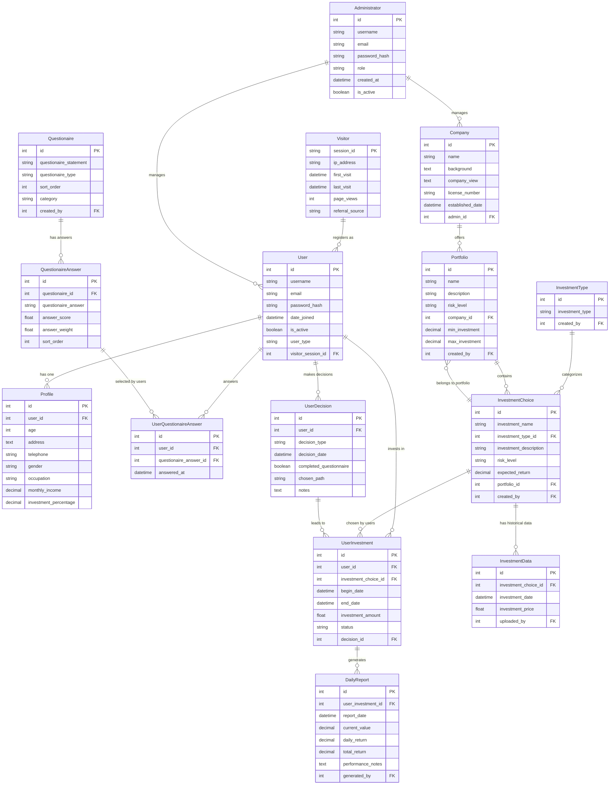
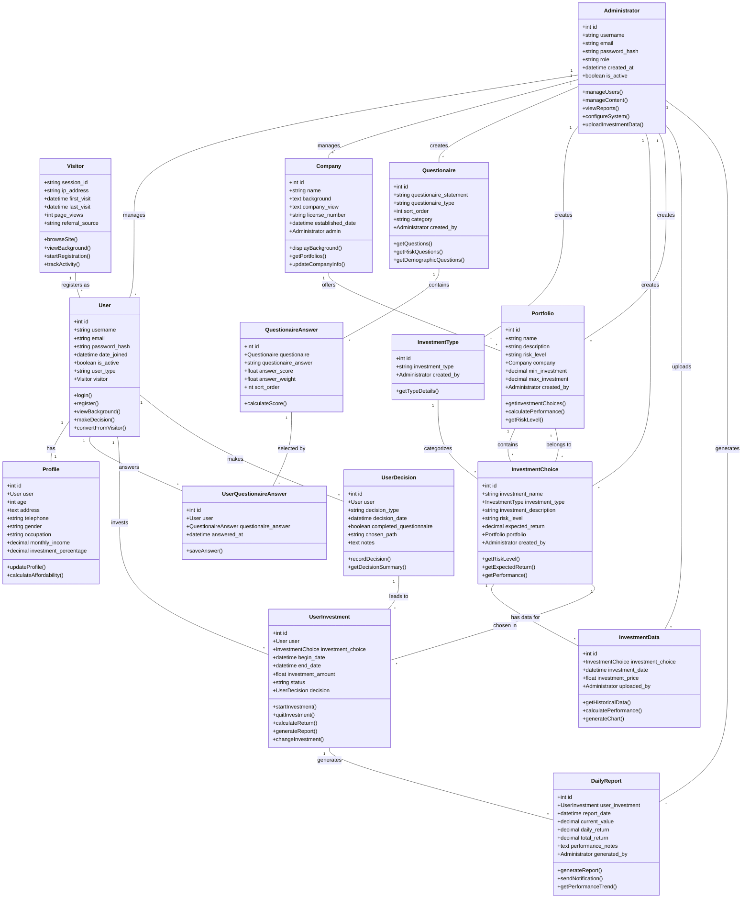

# Financial Investment System UML Diagram (With Visitors and Administrators)

## Entity Relationship Diagram

## Class Diagram with Relationships

## Relationship Summary Table

| Relationship | Type | Description |
|--------------|------|-------------|
| User → Profile | One-to-One | Each user has one profile with personal details |
| User → UserQuestionaireAnswer | One-to-Many | User can answer multiple questionnaire questions |
| User → UserInvestment | One-to-Many | User can have multiple investments |
| Questionaire → QuestionaireAnswer | One-to-Many | Each question has multiple possible answers |
| QuestionaireAnswer → UserQuestionaireAnswer | One-to-Many | Each answer can be selected by multiple users |
| InvestmentType → InvestmentChoice | One-to-Many | Each investment type has multiple choices |
| InvestmentChoice → InvestmentData | One-to-Many | Each investment choice has multiple historical data points |
| InvestmentChoice → UserInvestment | One-to-Many | Each investment choice can be selected by multiple users |

## Enhanced Business Logic Entities (Based on Requirements)

The following entities would need to be added to fully implement your described system:

1. **Company** - Background information, licensing
2. **Decision** - User's choice to proceed with/without questionnaire
3. **Portfolio** - Collection of investments (High/Medium/Low risk levels)
4. **Product** - Specific insurance/fund products
5. **DailyReport** - Performance tracking reports
6. **RiskAssessment** - Calculated risk scores from questionnaires
7. **AffordabilityScore** - Income percentage calculations

## Key Business Rules Captured

1. **Customer Journey**: User → Questionnaire → Risk Assessment → Investment Suggestion → Portfolio Selection
2. **Investment Options**: Direct purchase (without questionnaire) vs. Questionnaire-based recommendation
3. **Risk Levels**: High/Medium/Low return portfolios based on risk tolerance
4. **Performance Tracking**: Daily reports on portfolio performance
5. **Flexibility**: Users can quit investments or change portfolios

## Next Steps for Implementation

To fully implement your described system, consider adding these models:

1. Add `risk_score`, `affordability_score`, `income_percentage` fields to UserQuestionaireAnswer or a new RiskAssessment model
2. Create Portfolio model linking multiple InvestmentChoices with risk levels
3. Add Decision model to track user's choice path (direct purchase vs questionnaire)
4. Create DailyReport model for performance tracking
5. Add Company model for background information

This UML diagram provides a comprehensive view of both the existing system and the extended requirements for your financial investment platform.
